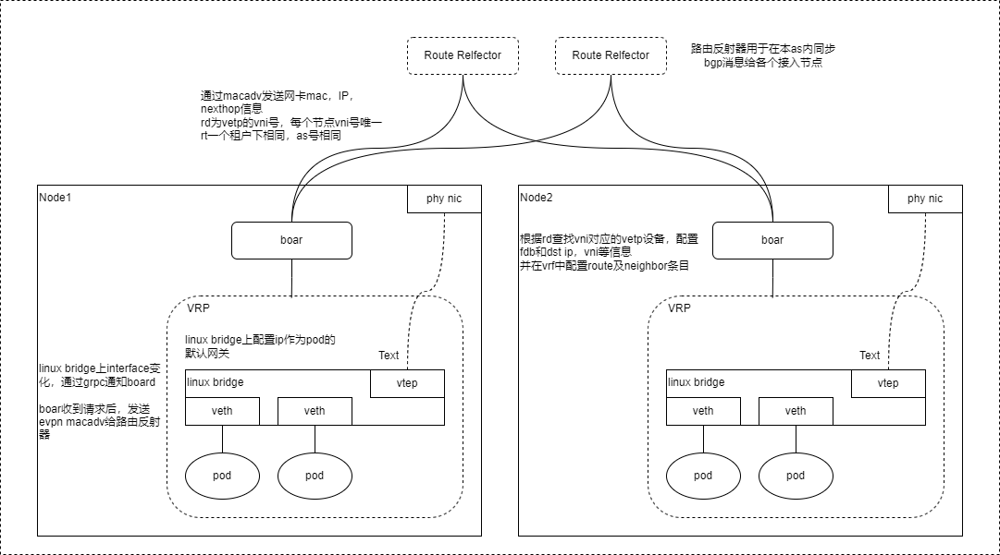

Boar
====

说明
----

Boar实现的k8s网络方案，通过vxlan打通节点间二层网络，通过bgp发送macadv消息给路由反射器(RR)来同步节点中pod网卡ip及mac信息。

一个k8s集群属于同一个AS域，由于所有pod可互通，不区分租户(一个租户对应一个RT)，使用每个节点vlxan的vtep设备的vni号作为RD(节点唯一)。

每个节点的Boar会和RR连接连接，并接受gRPC请求。当因新的pod加入或旧pod销毁而引发的bridge上interface变化时，向Boar发送gRPC请求告知，后Boar发送或删除bgp消息来同步interface的变化。其他节点收到后更新route，fdb，neighbor条目(fdb条目中包含本地vtep设备，远端ip，vni号等信息)。vtep设备做arp代答，避免arp泛洪。

pod对外网的访问，本地做masquerade。

